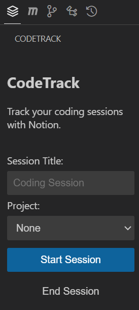

# CodeTrack

Track your coding sessions seamlessly with Notion integration in VS Code.

## Features

CodeTrack helps you maintain a detailed log of your coding sessions by automatically recording:

- Session start and end times
- Custom session titles
- Project association through Notion relations
- Direct integration with Notion databases
- Configurable property mapping



> The extension provides a convenient sidebar interface for managing your coding sessions.

## Requirements

- Visual Studio Code ^1.100.0
- Notion account with integration token
- Notion database with required properties:
  - Title field
  - Date field for time tracking
  - Relation field for project linking (optional)

## Setup

1. Install the extension
2. Get your Notion integration token from [Notion Integrations](https://www.notion.so/my-integrations)
3. Create a tracking database in Notion
4. Share your database with the integration
5. Set extension configuration in VS Code Settings
6. Open the settings panel to map your database properties

## Extension Configuration

This extension contributes the following config values:

* `codetrack.notionSecret`: Your Notion integration secret token
* `codetrack.trackingDatabaseURL`: URL of your Notion tracking database
* `codetrack.autoStartOnVSCode`: Enable/disable auto-start of a session when VS Code launches

## Extension Settings

CodeTrack can be customized to work with your specific Notion database structure:

1. Click the CodeTrack icon in the Activity Bar
2. Use the "Open Settings" command or button
3. Map your database fields:
   - Select your date/time property
   - Select your project relation property
4. Save your settings

## Usage

### Sidebar Interface

1. Click the CodeTrack icon in the activity bar
2. Enter an optional session title
3. Select a project (if configured)
4. Use "Start Session" and "End Session" buttons to control tracking

### Commands

Available commands:
- `CodeTrack: Start Session`: Begin tracking a new coding session
- `CodeTrack: End Session`: Finish the current coding session
- `CodeTrack: Open Settings`: Configure database property mappings
- `CodeTrack: Save Settings`: Save your property mapping configuration
- `CodeTrack: Clear Settings`: Reset your property mappings

## Future Updates

- Variably affect other database columns
- Offline capability
- Sessions end when VS Code is closed
- Sensing the start and end of a Session
- Multi Session Support
- Editing Page Info from VS Code

## Release Notes

> Coming Soon

## Development

```bash
# Install dependencies
npm install

# Compile
npm run compile

# Watch for changes
npm run watch

# Run tests
npm run test
```

For debugging, open Developer Tools in VS Code (Help > Toggle Developer Tools).

## Contributing

Contributions are welcome! Please feel free to submit a Pull Request.

## License

This extension is released under the MIT License.

---

**Enjoy tracking your coding sessions!**